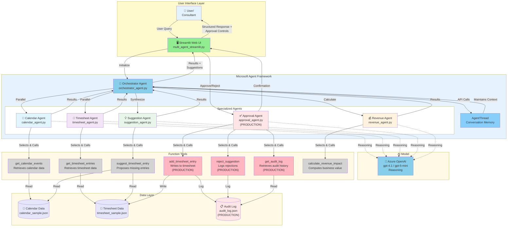

# TTU Agentic Revolution Challenge - CCG Time & Expense Agent

**Event**: TTU Agentic Revolution Challenge (November 14, 2025)  
**Challenge**: Contoso Consulting Group - Time & Expense Tracking with Agentic AI

## � About

**Developer**: Arturo Quiroga  
**Role**: Cloud Solution Architect - Data & AI, Microsoft  
**Location**: Toronto, Ontario, Canada

**Challenge Selection**: For this workshop, I chose the **Contoso Consulting Group (CCG) Time & Expense Tracking** scenario. This challenge focuses on using Agentic AI to automatically detect missing billable time by cross-referencing calendar events with timesheet entries—a common pain point for consulting firms that results in significant revenue leakage. I selected this scenario because it demonstrates real-world business value through intelligent automation, showcases the Microsoft Agent Framework's capabilities with function calling and multi-turn conversations, and addresses a tangible problem that every consulting organization faces.

## �🚀 Overview

This project demonstrates an intelligent AI agent built with **Microsoft Agent Framework** that helps consultants identify missing billable time by automatically cross-referencing calendar events with timesheet entries.

### Key Features

- 🔍 **Automatic Missing Time Detection** - Cross-references calendar and timesheet data
- 💰 **Revenue Impact Calculation** - Calculates lost billable hours and financial impact
- 🧠 **Multi-turn Conversation Memory** - Maintains context across interactions
- 🎯 **Context-aware Billability Rules** - Intelligently determines what should be billable
- 🛠️ **Function Calling** - Multiple tools: calendar, timesheet, suggestions, revenue, approval
- ✅ **Approval Workflow** - Review and approve/reject suggestions with audit trail (Production)
- 👥 **Multi-Consultant Support** - 5 consultants with diverse timesheet patterns
- 🔄 **Parallel Agent Execution** - Calendar and timesheet agents run simultaneously
- 📊 **Enhanced UI** - Consultant dropdown, question box, visual architecture diagram

### Business Impact

- **8 hours/week** missing time recovered per consultant
- **$2,000/week** in captured billable revenue per consultant
- **$2.6M/year** total impact for a 50-person consulting firm

## 📁 Project Structure

```
.
├── ccg-demo/                          # Single-agent demo (development version)
│   ├── streamlit_app.py              # Web UI (Streamlit)
│   ├── agent_demo.py                 # Console demo
│   ├── calendar_plugin.py            # Calendar function tool
│   ├── timesheet_plugin.py           # Timesheet function tools
│   ├── calendar_sample.json          # Sample calendar data (Nov 13-23, 2025)
│   ├── timesheet_sample.json         # Sample timesheet data
│   ├── requirements.txt              # Python dependencies
│   ├── .env.example                  # Environment variable template
│   └── README.md                     # Demo instructions
├── ccg-demo-multi-agent/              # Multi-agent architecture (development)
│   ├── README.md                     # Multi-agent documentation
│   ├── requirements.txt              # Dependencies
│   ├── .env.example                  # Config template
│   ├── agents/                       # Individual agent implementations
│   │   ├── calendar_agent.py         # Calendar analysis specialist
│   │   ├── timesheet_agent.py        # Timesheet validation specialist
│   │   ├── suggestion_agent.py       # Recommendation specialist
│   │   ├── revenue_agent.py          # Financial impact specialist
│   │   └── orchestrator_agent.py     # Workflow coordinator
│   ├── shared/                       # Shared data
│   │   ├── calendar_sample.json      # 40 events for arturoqu@microsoft.com
│   │   └── timesheet_sample.json     # Partial entries with missing time
│   └── multi_agent_streamlit.py      # Streamlit UI
├── ccg-demo-multi-agent-prod/         # PRODUCTION VERSION ⭐
│   ├── multi_agent_streamlit.py      # Production web UI with approval workflow
│   ├── requirements.txt              # Dependencies (agent-framework, streamlit)
│   ├── .env.example                  # Config template
│   ├── Dockerfile                    # Container image definition
│   ├── deploy-aca-clean.sh           # Azure Container Apps deployment script
│   ├── agents/                       # Production agents
│   │   ├── calendar_agent.py         # Calendar analysis
│   │   ├── timesheet_agent.py        # Timesheet validation
│   │   ├── suggestion_agent.py       # Missing entry detection
│   │   ├── approval_agent.py         # Approval workflow handler (PROD only)
│   │   ├── revenue_agent.py          # Revenue impact calculator
│   │   └── orchestrator_agent.py     # Multi-agent coordinator
│   ├── shared/                       # Enhanced production data
│   │   ├── calendar_sample.json      # 85 events, balanced across 5 consultants
│   │   ├── timesheet_sample.json     # 5 consultants with varied patterns
│   │   └── audit_log.json            # Approval/rejection audit trail
│   ├── diagrams/                     # Architecture documentation
│   │   └── architecture.md           # Mermaid diagram
│   └── tools/                        # Production function tools
├── ccg-presentation/                  # Presentation materials
│   ├── CCG_Readout.md                # 3-slide readout + script
│   ├── CCG_Readout.pptx              # PowerPoint presentation
│   ├── Architecture_Diagram.md       # Mermaid diagrams
│   └── *.mmd                         # Various architecture diagrams
└── Agentic_revolution_challenge_materials/  # Event materials
    └── ...
```

### Implementation Versions

**Single-Agent (`ccg-demo/`):**
- ✅ Simpler implementation, easier to understand
- ✅ All-in-one agent with multiple function tools
- ✅ Best for POC and straightforward demos
- ✅ Sequential processing
- Read-only operations

**Multi-Agent Dev (`ccg-demo-multi-agent/`):**
- ✅ Specialized agents for different domains
- ✅ Parallel execution for better performance
- ✅ Easier to maintain and extend
- ✅ Production-ready architecture foundation
- Read-only operations

**Multi-Agent Production (`ccg-demo-multi-agent-prod/`):** ⭐
- ✅ Full approval workflow with write capabilities
- ✅ 5 consultants with balanced demo data (85 calendar events)
- ✅ Consultant dropdown selector + question box
- ✅ Approval/rejection with audit trail
- ✅ HH:MM time format (realistic for consultant tracking)
- ✅ Enhanced parser for multiple suggestion formats
- ✅ Revenue impact calculator
- ✅ Deployed to Azure Container Apps
- ✅ Production-grade error handling
- **Live URL**: https://ccg-multi-agent-prod.wittyground-92ec3597.eastus.azurecontainerapps.io

## 🛠️ Technology Stack

- **Microsoft Agent Framework** - Latest AI orchestration framework (replaces Semantic Kernel)
- **Azure OpenAI** - GPT-4.1 or GPT-5-mini for agent reasoning
- **Python 3.13** - Core runtime
- **Streamlit** - Interactive web UI
- **Function Tools** - Simple Python functions for calendar/timesheet access

## 🚀 Quick Start

### Prerequisites

- Python 3.10+
- Azure OpenAI account (or OpenAI API key)
- Git

### Running Locally

#### Option 1: Production Version (Recommended for Demos)
```bash
cd ccg-demo-multi-agent-prod
python -m venv .venv
source .venv/bin/activate  # Windows: .venv\Scripts\activate
pip install -r requirements.txt
cp .env.example .env
# Edit .env with your Azure OpenAI credentials
streamlit run multi_agent_streamlit.py --server.port 8502
```
Open http://localhost:8502

#### Option 2: Development Single-Agent Version
```bash
cd ccg-demo
python -m venv .venv
source .venv/bin/activate
pip install -r requirements.txt
cp .env.example .env
# Edit .env with your credentials
streamlit run streamlit_app.py
```
Open http://localhost:8501

### Azure Deployment (Production)

```bash
cd ccg-demo-multi-agent-prod
./deploy-aca-clean.sh
```

This deploys to Azure Container Apps with:
- Docker containerization
- Azure Container Registry
- Automatic scaling
- HTTPS endpoint

## 🎯 Demo Flow

### Production Web UI Demo (5-7 minutes)

**Live URL**: https://ccg-multi-agent-prod.wittyground-92ec3597.eastus.azurecontainerapps.io

1. **Select Consultant** - Choose from 5 consultants with different patterns:
   - arturoqu@microsoft.com - Multiple missing travel entries
   - sarah.chen@contoso.com - Missing flight to Seattle
   - marcus.johnson@contoso.com - Missing drive to Chicago
   - priya.patel@contoso.com - Missing flight AND client dinner
   - james.rodriguez@contoso.com - Complete timesheet (good example)

2. **Ask Questions** (Optional) - Type specific questions like:
   - "What meetings did I miss logging?"
   - "How many billable hours am I missing?"

3. **Click "Analyze Missing Time"** - Multi-agent analysis runs:
   - Calendar Agent analyzes events
   - Timesheet Agent checks entries
   - Suggestion Agent identifies gaps
   - Shows detailed suggestions with rationale

4. **Review Approval Workflow** - Interactive cards showing:
   - Missing entry details (task, project, duration, billable status)
   - Approve/Reject buttons for each suggestion

5. **Check Revenue Impact** - Navigate to Revenue Impact tab:
   - Shows total missing billable hours
   - Calculates dollar value ($250/hour default rate)
   - Displays business impact

6. **View Audit Log** - Check Audit Log tab:
   - Complete history of approvals/rejections
   - Timestamps and user attribution
   - Immutable audit trail

### Sample Questions

- "What meetings did I miss logging?"
- "How many billable hours am I missing this week?"
- "Show me all client meetings without timesheet entries"
- "Calculate the revenue impact for my missing time"
- "Which entries are billable vs non-billable?"

## 🏗️ Architecture

### Production Multi-Agent Architecture

The production system uses specialized agents coordinated by an orchestrator:


```mermaid
graph TB
    subgraph UI_Layer["User Interface Layer"]
        User["👤 User/<br/>Consultant"]
        UI["🖥️ Streamlit Web UI<br/>multi_agent_streamlit.py"]
        User -->|"User Query"| UI
        UI -->|"Structured Response +<br/>Approval Controls"| User
    end
    
    subgraph Framework["Microsoft Agent Framework"]
        Orch["🎯 Orchestrator Agent<br/>orchestrator_agent.py"]
        
        subgraph Agents["Specialized Agents"]
            CalAgent["📅 Calendar Agent<br/>calendar_agent.py"]
            TimeAgent["📝 Timesheet Agent<br/>timesheet_agent.py"]
            SugAgent["💡 Suggestion Agent<br/>suggestion_agent.py"]
            AppAgent["✅ Approval Agent<br/>approval_agent.py<br/>(PRODUCTION)"]
            RevAgent["💰 Revenue Agent<br/>revenue_agent.py"]
        end
        
        Thread["AgentThread<br/>Conversation Memory"]
        
        UI -->|"Initialize"| Orch
        Orch -->|"Results +<br/>Suggestions"| UI
        
        Orch -->|"API Calls"| Thread
        Thread -->|"Maintains Context"| Orch
        
        Orch -->|"Parallel"| CalAgent
        Orch -->|"Parallel"| TimeAgent
        CalAgent -->|"Results"| Orch
        TimeAgent -->|"Results"| Orch
        
        Orch -->|"Synthesize"| SugAgent
        SugAgent -->|"Results"| Orch
        
        UI -->|"Approve/Reject"| AppAgent
        AppAgent -->|"Confirmation"| UI
        
        Orch -->|"Calculate"| RevAgent
        RevAgent -->|"Results"| Orch
    end
    
    subgraph AI_Model["AI Model"]
        GPT["🤖 Azure OpenAI<br/>gpt-4.1 / gpt-5-mini<br/>Reasoning"]
    end
    
    subgraph Tools["Function Tools"]
        CalTool["get_calendar_events<br/>Retrieves calendar data"]
        TimeTool["get_timesheet_entries<br/>Retrieves timesheet data"]
        SugTool["suggest_timesheet_entry<br/>Proposes missing entries"]
        WriteTool["add_timesheet_entry<br/>Writes to timesheet<br/>(PRODUCTION)"]
        RejectTool["reject_suggestion<br/>Logs rejections<br/>(PRODUCTION)"]
        AuditTool["get_audit_log<br/>Retrieves audit history<br/>(PRODUCTION)"]
        RevTool["calculate_revenue_impact<br/>Computes business value"]
    end
    
    CalAgent -->|"Selects & Calls"| CalTool
    TimeAgent -->|"Selects & Calls"| TimeTool
    SugAgent -->|"Selects & Calls"| SugTool
    AppAgent -->|"Selects & Calls"| WriteTool
    AppAgent -->|"Selects & Calls"| RejectTool
    AppAgent -->|"Selects & Calls"| AuditTool
    RevAgent -->|"Selects & Calls"| RevTool
    
    CalAgent -.->|"Reasoning"| GPT
    TimeAgent -.->|"Reasoning"| GPT
    SugAgent -.->|"Reasoning"| GPT
    AppAgent -.->|"Reasoning"| GPT
    RevAgent -.->|"Reasoning"| GPT
    
    subgraph Data_Layer["Data Layer"]
        CalData[("📁 Calendar Data<br/>calendar_sample.json")]
        TimeData[("📁 Timesheet Data<br/>timesheet_sample.json")]
        AuditData[("📋 Audit Log<br/>audit_log.json<br/>(PRODUCTION)")]
    end
    
    CalTool -->|"Read"| CalData
    TimeTool -->|"Read"| TimeData
    SugTool -->|"Read"| CalData
    SugTool -->|"Read"| TimeData
    WriteTool -->|"Write"| TimeData
    WriteTool -->|"Log"| AuditData
    RejectTool -->|"Log"| AuditData
    AuditTool -->|"Read"| AuditData
    
    style UI_Layer fill:#FFFACD
    style Framework fill:#E6F3FF
    style Agents fill:#FFFFFF
    style AI_Model fill:#FFF9E6
    style Tools fill:#FFF9E6
    style Data_Layer fill:#FFF9E6
    
    style User fill:#E3F2FD
    style UI fill:#90EE90
    style Orch fill:#87CEEB
    style CalAgent fill:#E1F5FE
    style TimeAgent fill:#F3E5F5
    style SugAgent fill:#E8F5E9
    style AppAgent fill:#FFE5E5
    style RevAgent fill:#FFF3E0
    style Thread fill:#87CEFA
    style GPT fill:#87CEEB
    
    style CalTool fill:#D3D3D3
    style TimeTool fill:#D3D3D3
    style SugTool fill:#D3D3D3
    style WriteTool fill:#FFB6C1
    style RejectTool fill:#FFB6C1
    style AuditTool fill:#FFB6C1
    style RevTool fill:#D3D3D3
    
    style CalData fill:#E6E6FA
    style TimeData fill:#E6E6FA
    style AuditData fill:#FFE6E6
```

**Key Components:**

1. **Orchestrator Agent** - Coordinates workflow and agent execution
2. **Calendar Agent** - Analyzes calendar events for billable activities
3. **Timesheet Agent** - Validates existing timesheet entries
4. **Suggestion Agent** - Identifies missing entries with rationale
5. **Approval Agent** - Handles approve/reject workflow with audit trail
6. **Revenue Agent** - Calculates financial impact of missing time

**Deployment:**
- Containerized with Docker
- Deployed to Azure Container Apps
- Auto-scaling based on load
- Production data with 5 consultants

## 📊 Business Value

### Problem
- Consultants lose 10-15% of billable time due to manual tracking errors
- Travel time and client meetings frequently go unbilled
- Manual timesheet review is time-consuming and error-prone

### Solution
- **Automated detection** - Agent cross-references calendar and timesheet in seconds
- **Context-aware reasoning** - Understands billability rules (travel = billable, internal meetings = not)
- **Proactive suggestions** - Provides clear rationale for each missing entry
- **Scalable** - ~$0.01 per invocation vs. $2.6M in captured revenue

### ROI
- **Time saved**: 99% reduction in timesheet review time (15 min → 5 seconds)
- **Revenue captured**: $1,000/week per consultant
- **Annual impact**: $2.6M for 50 consultants
- **AI cost**: Negligible (~$10/week for 1,000 reviews)

## 🔮 Production Roadmap

### Phase 1: POC (✅ Complete)
- ✅ Agent with function tools
- ✅ Sample data (JSON files)
- ✅ Web UI for demos
- ✅ Multi-turn conversation
- ✅ Multi-agent architecture with orchestrator
- ✅ Approval workflow with audit trail
- ✅ 5 consultants with balanced demo data (85 events)
- ✅ HH:MM time format for realistic tracking
- ✅ Azure Container Apps deployment
- ✅ Enhanced UI with dropdowns and question box

### Phase 2: Integration (2-4 weeks)
- [ ] Microsoft Graph API for real calendar data
- [ ] ERP system integration (SAP/Workday/NetSuite)
- [ ] Azure Active Directory authentication
- [ ] Approval workflow via Teams notifications
- [ ] Email notifications for missing time
- [ ] **Hybrid orchestration** - Leverage MAF orchestration patterns (Sequential, Parallel, Conditional) for deterministic workflows while retaining orchestrator agent for intelligent decision-making

### Phase 3: Scale (4-8 weeks)
- [ ] Manager dashboard with analytics
- [ ] Personalized billability rules per consultant
- [ ] Historical learning from corrections
- [ ] Audit trail and compliance reporting
- [ ] Weekly automated reminders
- [ ] Mobile app integration

### Phase 4: Advanced AI Capabilities (8-12 weeks)
- [ ] **MAF Group Chat Pattern** - Enable agents to collaborate dynamically on complex scenarios
- [ ] Predictive analytics for time tracking patterns
- [ ] Anomaly detection for unusual billing patterns
- [ ] Natural language policy configuration
- [ ] Multi-language support for global teams

## 📚 Documentation

- **[Demo Guide](ccg-demo/README.md)** - Detailed setup and run instructions
- **[Improvements Doc](ccg-demo/DEMO_IMPROVEMENTS.md)** - Enhancement details and metrics
- **[Readout Script](ccg-presentation/CCG_Readout.md)** - 3-minute timed presentation script
- **[Event Materials](Agentic_revolution_challenge_materials/)** - Challenge details and findings

## 🤝 Contributing

This is a competition demo project. Feedback and suggestions are welcome via issues!

## 📄 License

MIT License - see LICENSE file for details

## 🙏 Acknowledgments

- **TTU** - For hosting the Agentic Revolution Challenge
- **Microsoft** - For the Agent Framework and Azure OpenAI
- **Contoso Consulting Group** - For the challenge scenario

## 📧 Contact

For questions about this demo, please open an issue on GitHub.

---

**Built with Microsoft Agent Framework | Azure OpenAI | Streamlit**  
**TTU Agentic Revolution Challenge 2025**
