# TTU Agentic Revolution Challenge - CCG Time & Expense Agent

**Event**: TTU Agentic Revolution Challenge (November 14, 2025)  
**Challenge**: Contoso Consulting Group - Time & Expense Tracking with Agentic AI

## � About

**Developer**: Arturo Quiroga  
**Role**: Cloud Solution Architect - Data & AI, Microsoft  
**Location**: Toronto, Ontario, Canada

**Challenge Selection**: For this workshop, I chose the **Contoso Consulting Group (CCG) Time & Expense Tracking** scenario. This challenge focuses on using Agentic AI to automatically detect missing billable time by cross-referencing calendar events with timesheet entries—a common pain point for consulting firms that results in significant revenue leakage. I selected this scenario because it demonstrates real-world business value through intelligent automation, showcases the Microsoft Agent Framework's capabilities with function calling and multi-turn conversations, and addresses a tangible problem that every consulting organization faces.

## �🚀 Overview

This project demonstrates an intelligent AI agent built with **Microsoft Agent Framework** that helps consultants identify missing billable time by automatically cross-referencing calendar events with timesheet entries.

### Key Features

- 🔍 **Automatic Missing Time Detection** - Cross-references calendar and timesheet data
- 💰 **Revenue Impact Calculation** - Calculates lost billable hours ($2.6M annually for 50 consultants)
- 🧠 **Multi-turn Conversation Memory** - Maintains context across interactions
- 🎯 **Context-aware Billability Rules** - Intelligently determines what should be billable
- 🛠️ **Function Calling** - Uses 4 tools: calendar access, timesheet access, suggestions, revenue calculation

### Business Impact

- **8 hours/week** missing time recovered per consultant
- **$2,000/week** in captured billable revenue per consultant
- **$2.6M/year** total impact for a 50-person consulting firm

## 📁 Project Structure

```
.
├── ccg-demo/                          # Single-agent demo (recommended starting point)
│   ├── streamlit_app.py              # Web UI (Streamlit)
│   ├── agent_demo.py                 # Console demo
│   ├── calendar_plugin.py            # Calendar function tool
│   ├── timesheet_plugin.py           # Timesheet function tools
│   ├── calendar_sample.json          # Sample calendar data (Nov 13-23, 2025)
│   ├── timesheet_sample.json         # Sample timesheet data
│   ├── requirements.txt              # Python dependencies
│   ├── .env.example                  # Environment variable template
│   ├── README.md                     # Demo instructions
│   └── DEMO_IMPROVEMENTS.md          # Enhancement documentation
├── ccg-demo-multi-agent/              # Multi-agent architecture (advanced)
│   ├── README.md                     # Multi-agent documentation
│   ├── requirements.txt              # Dependencies
│   ├── .env.example                  # Config template
│   ├── agents/                       # Individual agent implementations
│   │   ├── calendar_agent.py         # Calendar analysis specialist
│   │   ├── timesheet_agent.py        # Timesheet validation specialist
│   │   ├── suggestion_agent.py       # Recommendation specialist
│   │   ├── revenue_agent.py          # Financial impact specialist
│   │   └── orchestrator_agent.py     # Workflow coordinator
│   ├── shared/                       # Shared data (symlinks to ccg-demo/)
│   │   ├── calendar_sample.json      # -> ../../ccg-demo/calendar_sample.json
│   │   └── timesheet_sample.json     # -> ../../ccg-demo/timesheet_sample.json
│   ├── multi_agent_demo.py           # Console demo (coming soon)
│   └── multi_agent_streamlit.py      # Streamlit UI (coming soon)
├── ccg-presentation/                  # Presentation materials
│   ├── CCG_Readout.md                # 3-slide readout + script
│   ├── CCG_Readout.pptx              # PowerPoint presentation
│   ├── Architecture_Diagram.md       # Mermaid diagrams
│   ├── PPT_Slide_Content.md          # Detailed slide content
│   ├── solution-architecture.mmd     # Full architecture diagram
│   ├── simplified-architecture.mmd   # Simple architecture diagram
│   └── data-flow-sequence.mmd        # Sequence diagram
└── Agentic_revolution_challenge_materials/  # Event materials
    └── ...
```

### Implementation Approaches

**Single-Agent (`ccg-demo/`):**
- ✅ Simpler implementation, easier to understand
- ✅ All-in-one agent with multiple function tools
- ✅ Best for POC and straightforward demos
- Sequential processing

**Multi-Agent (`ccg-demo-multi-agent/`):**
- ✅ Specialized agents for different domains
- ✅ Can execute agents in parallel for better performance
- ✅ Easier to maintain and extend individual capabilities
- ✅ Production-ready architecture
- Better for complex workflows

## 🛠️ Technology Stack

- **Microsoft Agent Framework** - Latest AI orchestration framework (replaces Semantic Kernel)
- **Azure OpenAI** - GPT-4.1 or GPT-5-mini for agent reasoning
- **Python 3.13** - Core runtime
- **Streamlit** - Interactive web UI
- **Function Tools** - Simple Python functions for calendar/timesheet access

## 🚀 Quick Start

### Prerequisites

- Python 3.10+
- Azure OpenAI account (or OpenAI API key)
- Git

### Installation

1. **Clone the repository**
   ```bash
   git clone https://github.com/YOUR_USERNAME/ttu-agentic-revolution-challenge.git
   cd ttu-agentic-revolution-challenge
   ```

2. **Create virtual environment**
   ```bash
   python -m venv .venv
   source .venv/bin/activate  # On Windows: .venv\Scripts\activate
   ```

3. **Install dependencies**
   ```bash
   pip install -r ccg-demo/requirements.txt
   ```

4. **Configure environment**
   ```bash
   cp ccg-demo/.env.example ccg-demo/.env
   # Edit .env with your Azure OpenAI credentials
   ```

### Running the Demo

#### Option 1: Web UI (Recommended for Presentations)
```bash
streamlit run ccg-demo/streamlit_app.py
```
Then open http://localhost:8501 in your browser.

#### Option 2: Console Demo
```bash
python ccg-demo/agent_demo.py
```

## 🎯 Demo Flow

### Web UI Demo (3-5 minutes)

1. **Open the app** - Clean, professional interface with branding
2. **Click "📋 Review my calendar..."** - Agent analyzes and finds 8 missing hours
3. **Click "💰 Calculate the revenue..."** - Shows $2,000 impact
4. **Click "✅ Yes, please proceed..."** - Demonstrates multi-turn memory
5. **Type custom questions** - Shows natural conversation capability

### Sample Questions

- "Review my calendar and timesheet for November 13-14, 2025. My email is alice@ccg.com."
- "Calculate the revenue impact for the missing billable hours you found."
- "Which entries are billable vs non-billable?"
- "Can you help me understand my missing time entries?"
- "Yes, please proceed with submitting those missing timesheet entries."

## 🏗️ Architecture

### Simplified Architecture

```mermaid
graph LR
    User[👤 User] -->|Query| Agent[🤖 ChatAgent<br/>Microsoft Agent Framework]
    Agent -->|Reasoning| GPT[💭 gpt-4.1/gpt-5-mini<br/>Azure OpenAI]
    Agent -->|Calls| Tools[🔧 Function Tools]
    
    subgraph Tools
        T1[📅 Calendar]
        T2[⏱️ Timesheet]
        T3[💡 Suggestions]
        T4[💰 Revenue]
    end
    
    Tools -->|Data| Data[(📊 Sample Data)]
    Agent -->|Response| User

    style Agent fill:#0078d4,color:#fff
    style GPT fill:#50e6ff,color:#000
    style Tools fill:#68217a,color:#fff
```



### Detailed Solution Architecture


### Data Flow Sequence

```mermaid
sequenceDiagram
    participant User
    participant ChatAgent
    participant GPT4.1/5-mini
    participant CalendarTool
    participant TimesheetTool
    participant SuggestionTool

    User->>ChatAgent: "Review my calendar and timesheet"
    ChatAgent->>GPT4.1/5-mini: Process query with instructions
    GPT4.1/5-mini->>ChatAgent: Decision: Call calendar function
    ChatAgent->>CalendarTool: get_calendar_events("arturo@ccg.com")
    CalendarTool-->>ChatAgent: 7 events (14 hours total)
    ChatAgent->>GPT4.1/5-mini: Here's calendar data
    GPT4.1/5-mini->>ChatAgent: Decision: Call timesheet function
    ChatAgent->>TimesheetTool: get_timesheet_entries("arturo@ccg.com")
    TimesheetTool-->>ChatAgent: 2 entries (3.5 hours logged)
    ChatAgent->>GPT4.1/5-mini: Compare data
    GPT4.1/5-mini->>ChatAgent: Decision: Call suggestion function
    ChatAgent->>SuggestionTool: suggest_timesheet_entry(...)
    SuggestionTool-->>ChatAgent: 5 missing entries (8 hours)
    ChatAgent->>GPT4.1/5-mini: Format response
    GPT4.1/5-mini->>ChatAgent: Structured analysis with rationale
    ChatAgent->>User: "Found 8 missing hours worth $2,000..."
    User->>ChatAgent: "Yes, submit those entries"
    ChatAgent->>GPT4.1/5-mini: Process confirmation
    GPT4.1/5-mini->>ChatAgent: Confirm action
    ChatAgent->>User: "✅ All 5 entries confirmed"
```



### Multi-turn Conversation

- Uses `AgentThread` for conversation memory
- Automatically maintains context across interactions
- Supports follow-up questions and clarifications

### Function Tools

All tools are simple Python functions (no decorators or complex plugins):

1. **`get_calendar_events(user_email)`** - Returns calendar events from JSON
2. **`get_timesheet_entries(user_email)`** - Returns existing timesheet entries
3. **`suggest_timesheet_entry(...)`** - Records a suggestion with rationale
4. **`calculate_revenue_impact(user_email, billable_rate)`** - Calculates financial impact

## 📊 Business Value

### Problem
- Consultants lose 10-15% of billable time due to manual tracking errors
- Travel time and client meetings frequently go unbilled
- Manual timesheet review is time-consuming and error-prone

### Solution
- **Automated detection** - Agent cross-references calendar and timesheet in seconds
- **Context-aware reasoning** - Understands billability rules (travel = billable, internal meetings = not)
- **Proactive suggestions** - Provides clear rationale for each missing entry
- **Scalable** - ~$0.01 per invocation vs. $2.6M in captured revenue

### ROI
- **Time saved**: 99% reduction in timesheet review time (15 min → 5 seconds)
- **Revenue captured**: $1,000/week per consultant
- **Annual impact**: $2.6M for 50 consultants
- **AI cost**: Negligible (~$10/week for 1,000 reviews)

## 🔮 Production Roadmap

### Phase 1: POC (Complete)
- ✅ Agent with function tools
- ✅ Sample data (JSON files)
- ✅ Web UI for demos
- ✅ Multi-turn conversation

### Phase 2: Integration (2-4 weeks)
- [ ] Microsoft Graph API for real calendar data
- [ ] ERP system integration (SAP/Workday/NetSuite)
- [ ] Azure Active Directory authentication
- [ ] Approval workflow (Teams notifications)

### Phase 3: Scale (4-8 weeks)
- [ ] Multi-agent architecture (calendar agent + timesheet agent + approval agent)
- [ ] Manager dashboard with analytics
- [ ] Personalized billability rules per consultant
- [ ] Historical learning from corrections
- [ ] Audit trail and compliance reporting

## 📚 Documentation

- **[Demo Guide](ccg-demo/README.md)** - Detailed setup and run instructions
- **[Improvements Doc](ccg-demo/DEMO_IMPROVEMENTS.md)** - Enhancement details and metrics
- **[Readout Script](ccg-presentation/CCG_Readout.md)** - 3-minute timed presentation script
- **[Event Materials](Agentic_revolution_challenge_materials/)** - Challenge details and findings

## 🤝 Contributing

This is a competition demo project. Feedback and suggestions are welcome via issues!

## 📄 License

MIT License - see LICENSE file for details

## 🙏 Acknowledgments

- **TTU** - For hosting the Agentic Revolution Challenge
- **Microsoft** - For the Agent Framework and Azure OpenAI
- **Contoso Consulting Group** - For the challenge scenario

## 📧 Contact

For questions about this demo, please open an issue on GitHub.

---

**Built with Microsoft Agent Framework | Azure OpenAI | Streamlit**  
**TTU Agentic Revolution Challenge 2025**
