```mermaid
graph TB
    subgraph "🎯 Orchestrator Agent"
        O[Orchestrator<br/>Workflow Manager]
    end
    
    O -->|"1. Parallel"| CA
    O -->|"2. Parallel"| TA
    O -->|"3. Synthesize"| SA
    O -->|"4. Approve/Reject"| AA
    O -->|"5. Calculate"| RA
    
    CA -->|Results| O
    TA -->|Results| O
    SA -->|Suggestions| O
    AA -->|Confirmation| O
    RA -->|Impact| O
    
    subgraph "📅 Calendar Agent Domain"
        CA[Calendar Agent<br/>Expert]
        CA_Inst["Instructions:<br/>- Analyze calendar events<br/>- Classify billability<br/>- Identify travel time<br/>- Calculate durations"]
        CA_Tools["Tools:<br/>get_calendar_events()"]
        CA_Data[("calendar_sample.json<br/>Events, meetings,<br/>travel, context")]
        
        CA --> CA_Inst
        CA --> CA_Tools
        CA_Tools --> CA_Data
    end
    
    subgraph "📝 Timesheet Agent Domain"
        TA[Timesheet Agent<br/>Expert]
        TA_Inst["Instructions:<br/>- Review time entries<br/>- Validate completeness<br/>- Identify gaps<br/>- Calculate totals"]
        TA_Tools["Tools:<br/>get_timesheet_entries()"]
        TA_Data[("timesheet_sample.json<br/>Time entries,<br/>projects, hours")]
        
        TA --> TA_Inst
        TA --> TA_Tools
        TA_Tools --> TA_Data
    end
    
    subgraph "💡 Suggestion Agent Domain"
        SA[Suggestion Agent<br/>Expert]
        SA_Inst["Instructions:<br/>- Cross-reference data<br/>- Propose missing entries<br/>- Provide rationale<br/>- Prioritize billable time"]
        SA_Tools["Tools:<br/>suggest_timesheet_entry()"]
        SA_Context["Context:<br/>Calendar analysis +<br/>Timesheet analysis"]
        
        SA --> SA_Inst
        SA --> SA_Tools
        SA --> SA_Context
    end
    
    subgraph "✅ Approval Agent Domain (PRODUCTION)"
        AA[Approval Agent<br/>Expert]
        AA_Inst["Instructions:<br/>- Process approvals<br/>- Write to timesheet<br/>- Log rejections<br/>- Maintain audit trail"]
        AA_Tools["Tools:<br/>add_timesheet_entry()<br/>reject_suggestion()<br/>get_audit_log()"]
        AA_Data[("timesheet_sample.json<br/>(WRITE ACCESS)<br/>+<br/>audit_log.json")]
        
        AA --> AA_Inst
        AA --> AA_Tools
        AA_Tools --> AA_Data
    end
    
    subgraph "💰 Revenue Agent Domain"
        RA[Revenue Agent<br/>Expert]
        RA_Inst["Instructions:<br/>- Calculate revenue impact<br/>- Project annual costs<br/>- Firm-wide analysis<br/>- ROI calculations"]
        RA_Tools["Tools:<br/>calculate_revenue_impact()"]
        RA_Context["Context:<br/>Missing hours +<br/>Billable rate"]
        
        RA --> RA_Inst
        RA --> RA_Tools
        RA --> RA_Context
    end
    
    style O fill:#90CAF9,stroke:#1976D2,stroke-width:3px
    style CA fill:#E1F5FE,stroke:#01579B,stroke-width:2px
    style TA fill:#F3E5F5,stroke:#4A148C,stroke-width:2px
    style SA fill:#E8F5E9,stroke:#1B5E20,stroke-width:2px
    style AA fill:#FFE5E5,stroke:#C62828,stroke-width:3px
    style RA fill:#FFF3E0,stroke:#E65100,stroke-width:2px
    
    style CA_Inst fill:#B3E5FC
    style TA_Inst fill:#E1BEE7
    style SA_Inst fill:#C8E6C9
    style AA_Inst fill:#FFCDD2
    style RA_Inst fill:#FFE0B2
    
    style CA_Tools fill:#81D4FA
    style TA_Tools fill:#CE93D8
    style SA_Tools fill:#A5D6A7
    style AA_Tools fill:#EF9A9A
    style RA_Tools fill:#FFCC80
    
    style CA_Data fill:#4FC3F7
    style TA_Data fill:#BA68C8
    style SA_Context fill:#81C784
    style AA_Data fill:#E57373
    style RA_Context fill:#FFB74D
```

**Agent Specialization & Domain Expertise - PRODUCTION VERSION**

This diagram highlights:
- **Domain Separation**: Each agent has focused expertise and context
- **Specialized Instructions**: Tailored guidance for each agent's role
- **Domain-Specific Tools**: Each agent has appropriate function tools
- **Orchestration Flow**: Numbered execution order (1→2→3→4→5)
- **Data Access**: Agents only access relevant data for their domain
- **✅ Approval Agent**: NEW agent with write access for production workflow
- **Audit Trail**: Approval agent maintains complete audit log

**Production Enhancements:**
- ⭐ **Approval Agent Domain**: New agent for processing approved/rejected suggestions
- 💾 **Write Tools**: `add_timesheet_entry()`, `reject_suggestion()`, `get_audit_log()`
- 📋 **Audit Log**: Complete audit trail in `audit_log.json`
- 🔒 **Security**: Write access controlled through approval workflow

**Benefits of Multi-Agent Architecture:**
- ✅ **Parallel Execution**: Calendar + Timesheet agents run simultaneously
- ✅ **Focused Context**: Each agent maintains domain-specific expertise
- ✅ **Independent Scaling**: Agents can be optimized separately
- ✅ **Maintainability**: Changes to one agent don't affect others
- ✅ **Clear Ownership**: Each agent has well-defined responsibilities
- ✅ **Controlled Writes**: Approval agent isolates write operations with validation
