```mermaid
graph TB
    subgraph UI_Layer["User Interface Layer"]
        User["👤 User/<br/>Consultant"]
        UI["🖥️ Streamlit Web UI<br/>multi_agent_streamlit.py"]
        User -->|"User Query"| UI
        UI -->|"Structured Response +<br/>Approval Controls"| User
    end
    
    subgraph Framework["Microsoft Agent Framework"]
        Orch["🎯 Orchestrator Agent<br/>orchestrator_agent.py"]
        
        subgraph Agents["Specialized Agents"]
            CalAgent["📅 Calendar Agent<br/>calendar_agent.py"]
            TimeAgent["📝 Timesheet Agent<br/>timesheet_agent.py"]
            SugAgent["💡 Suggestion Agent<br/>suggestion_agent.py"]
            AppAgent["✅ Approval Agent<br/>approval_agent.py<br/>(PRODUCTION)"]
            RevAgent["💰 Revenue Agent<br/>revenue_agent.py"]
        end
        
        Thread["AgentThread<br/>Conversation Memory"]
        
        UI -->|"Initialize"| Orch
        Orch -->|"Results +<br/>Suggestions"| UI
        
        Orch -->|"API Calls"| Thread
        Thread -->|"Maintains Context"| Orch
        
        Orch -->|"Parallel"| CalAgent
        Orch -->|"Parallel"| TimeAgent
        CalAgent -->|"Results"| Orch
        TimeAgent -->|"Results"| Orch
        
        Orch -->|"Synthesize"| SugAgent
        SugAgent -->|"Results"| Orch
        
        UI -->|"Approve/Reject"| AppAgent
        AppAgent -->|"Confirmation"| UI
        
        Orch -->|"Calculate"| RevAgent
        RevAgent -->|"Results"| Orch
    end
    
    subgraph AI_Model["AI Model"]
        GPT["🤖 Azure OpenAI<br/>gpt-4.1 / gpt-5-mini<br/>Reasoning"]
    end
    
    subgraph Tools["Function Tools"]
        CalTool["get_calendar_events<br/>Retrieves calendar data"]
        TimeTool["get_timesheet_entries<br/>Retrieves timesheet data"]
        SugTool["suggest_timesheet_entry<br/>Proposes missing entries"]
        WriteTool["add_timesheet_entry<br/>Writes to timesheet<br/>(PRODUCTION)"]
        RejectTool["reject_suggestion<br/>Logs rejections<br/>(PRODUCTION)"]
        AuditTool["get_audit_log<br/>Retrieves audit history<br/>(PRODUCTION)"]
        RevTool["calculate_revenue_impact<br/>Computes business value"]
    end
    
    CalAgent -->|"Selects & Calls"| CalTool
    TimeAgent -->|"Selects & Calls"| TimeTool
    SugAgent -->|"Selects & Calls"| SugTool
    AppAgent -->|"Selects & Calls"| WriteTool
    AppAgent -->|"Selects & Calls"| RejectTool
    AppAgent -->|"Selects & Calls"| AuditTool
    RevAgent -->|"Selects & Calls"| RevTool
    
    CalAgent -.->|"Reasoning"| GPT
    TimeAgent -.->|"Reasoning"| GPT
    SugAgent -.->|"Reasoning"| GPT
    AppAgent -.->|"Reasoning"| GPT
    RevAgent -.->|"Reasoning"| GPT
    
    subgraph Data_Layer["Data Layer"]
        CalData[("📁 Calendar Data<br/>calendar_sample.json")]
        TimeData[("📁 Timesheet Data<br/>timesheet_sample.json")]
        AuditData[("📋 Audit Log<br/>audit_log.json<br/>(PRODUCTION)")]
    end
    
    CalTool -->|"Read"| CalData
    TimeTool -->|"Read"| TimeData
    SugTool -->|"Read"| CalData
    SugTool -->|"Read"| TimeData
    WriteTool -->|"Write"| TimeData
    WriteTool -->|"Log"| AuditData
    RejectTool -->|"Log"| AuditData
    AuditTool -->|"Read"| AuditData
    
    style UI_Layer fill:#FFFACD
    style Framework fill:#E6F3FF
    style Agents fill:#FFFFFF
    style AI_Model fill:#FFF9E6
    style Tools fill:#FFF9E6
    style Data_Layer fill:#FFF9E6
    
    style User fill:#E3F2FD
    style UI fill:#90EE90
    style Orch fill:#87CEEB
    style CalAgent fill:#E1F5FE
    style TimeAgent fill:#F3E5F5
    style SugAgent fill:#E8F5E9
    style AppAgent fill:#FFE5E5
    style RevAgent fill:#FFF3E0
    style Thread fill:#87CEFA
    style GPT fill:#87CEEB
    
    style CalTool fill:#D3D3D3
    style TimeTool fill:#D3D3D3
    style SugTool fill:#D3D3D3
    style WriteTool fill:#FFB6C1
    style RejectTool fill:#FFB6C1
    style AuditTool fill:#FFB6C1
    style RevTool fill:#D3D3D3
    
    style CalData fill:#E6E6FA
    style TimeData fill:#E6E6FA
    style AuditData fill:#FFE6E6
```

**Multi-Agent Architecture - PRODUCTION VERSION**

This diagram shows the production architecture with approval workflow:

**Key Enhancements:**
- **✅ Approval Agent** - NEW agent for processing approved/rejected suggestions
- **💾 Write Tools** - `add_timesheet_entry()` writes approved entries to timesheet
- **📋 Audit Log** - Complete audit trail in `audit_log.json`
- **🔄 Approval Workflow** - User reviews suggestions before writing

**Workflow:**
1. **Analysis Phase**: Calendar + Timesheet agents run in parallel
2. **Suggestion Phase**: Suggestion agent proposes missing entries
3. **Approval Phase**: User reviews and approves/rejects via UI
4. **Write Phase**: Approval agent writes approved entries to timesheet
5. **Audit Phase**: All operations logged with timestamps and user attribution

**Security:**
- All write operations require user approval
- Complete audit trail maintained
- Immutable log (add-only, no deletions)
- User attribution for all actions
