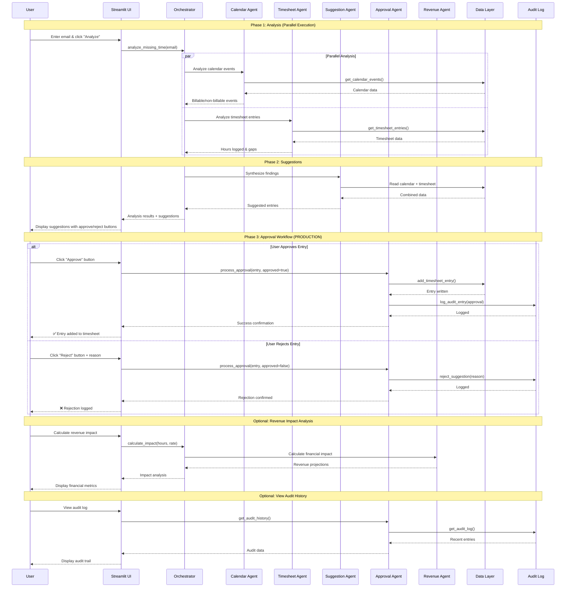

**Workflow Sequence - PRODUCTION VERSION**

This diagram illustrates the complete workflow including approval and write operations:

**Phase 1: Analysis (Parallel)**
- Calendar Agent and Timesheet Agent run simultaneously
- Reduces analysis time by ~50%
- Both agents query their respective data sources

**Phase 2: Suggestions**
- Suggestion Agent cross-references findings
- Proposes missing entries with rationale
- Results displayed to user for review

**Phase 3: Approval Workflow** ⭐ NEW
- User reviews each suggestion
- Approves → Writes to timesheet + logs in audit
- Rejects → Logs rejection reason in audit
- All actions attributed to user

**Phase 4: Revenue Impact (Optional)**
- Calculate financial value of missing time
- Show ROI of time tracking improvements
- Scale to firm-wide projections

**Phase 5: Audit History (Optional)**
- View complete audit trail
- Track all approvals and rejections
- Compliance and troubleshooting
