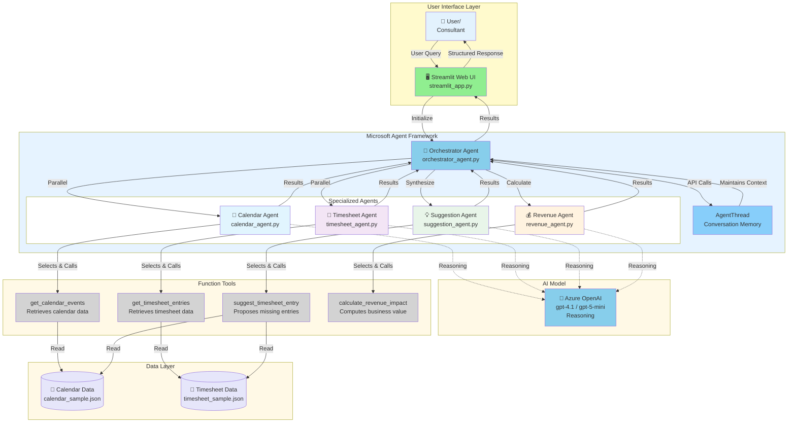

**Multi-Agent Architecture**

This diagram shows the specialized agent architecture where:
- **Orchestrator** coordinates workflow between specialized agents
- **Calendar & Timesheet Agents** run in parallel for efficiency
- **Suggestion Agent** synthesizes findings from both sources
- **Revenue Agent** calculates business impact
- Each agent has domain-specific tools and expertise
- All agents use Azure OpenAI for intelligent reasoning
