```mermaid
sequenceDiagram
    actor User as 👤 Consultant
    participant UI as 🖥️ Streamlit UI
    participant Orch as 🎯 Orchestrator
    participant Cal as 📅 Calendar Agent
    participant Time as 📝 Timesheet Agent
    participant Sug as 💡 Suggestion Agent
    participant Rev as 💰 Revenue Agent
    participant GPT as 🤖 Azure OpenAI
    participant Data as 📁 Sample Data
    
    User->>UI: Request missing time analysis
    UI->>Orch: analyze_missing_time(user_email, parallel=True)
    
    Note over Orch: Phase 1: Parallel Data Analysis
    
    par Parallel Execution
        Orch->>Cal: Analyze calendar events
        Cal->>Data: get_calendar_events(user_email)
        Data-->>Cal: Calendar events
        Cal->>GPT: Classify billability & travel
        GPT-->>Cal: Analysis with rationale
        Cal-->>Orch: Calendar analysis results
    and
        Orch->>Time: Analyze timesheet entries
        Time->>Data: get_timesheet_entries(user_email)
        Data-->>Time: Timesheet entries
        Time->>GPT: Identify gaps & completeness
        GPT-->>Time: Analysis with gaps
        Time-->>Orch: Timesheet analysis results
    end
    
    Note over Orch: Phase 2: Synthesize Findings
    
    Orch->>Sug: Cross-reference calendar + timesheet
    Sug->>GPT: Identify missing entries with context
    GPT-->>Sug: Suggested entries with rationale
    Sug-->>Orch: Missing entry suggestions
    
    Note over Orch: Phase 3: Calculate Impact
    
    Orch->>Rev: calculate_impact(missing_hours, rate)
    Rev->>GPT: Calculate revenue impact
    GPT-->>Rev: Financial analysis
    Rev-->>Orch: Revenue impact results
    
    Orch-->>UI: Complete analysis (all phases)
    UI-->>User: Display unified results
    
    Note over User,Data: Multi-agent workflow complete<br/>Calendar + Timesheet agents ran in parallel<br/>Suggestion agent synthesized findings<br/>Revenue agent calculated business impact
```

**Multi-Agent Workflow Sequence**

This sequence diagram illustrates:
- **Phase 1**: Calendar and Timesheet agents execute in parallel for efficiency
- **Phase 2**: Suggestion agent synthesizes findings after both complete
- **Phase 3**: Revenue agent calculates financial impact
- **Orchestrator** manages the complete workflow and aggregates results
- Each agent maintains its own conversation with Azure OpenAI for focused expertise
