# CCG Time & Expense Agent - Architecture Diagram

## Solution Architecture (Mermaid Format)

Copy this code into any Mermaid renderer (mermaid.live, or VS Code Mermaid extension) to generate the diagram:

## Alternative: Simplified Architecture (For Slide)

```mermaid
graph LR
    User[👤 User] -->|Query| Agent[🤖 ChatAgent<br/>Microsoft Agent Framework]
    Agent -->|Reasoning| GPT[💭 gpt-4.1/gpt-5-mini<br/>Azure OpenAI]
    Agent -->|Calls| Tools[🔧 Function Tools]
    
    subgraph Tools
        T1[📅 Calendar]
        T2[⏱️ Timesheet]
        T3[💡 Suggestions]
        T4[💰 Revenue]
    end
    
    Tools -->|Data| Data[(📊 Sample Data)]
    Agent -->|Response| User

    style Agent fill:#0078d4,color:#fff
    style GPT fill:#50e6ff,color:#000
    style Tools fill:#68217a,color:#fff
```

## Data Flow Diagram

## How to Use These Diagrams

### For PowerPoint:

1. **Generate PNG/SVG**:
   - Go to https://mermaid.live
   - Paste the Mermaid code
   - Export as PNG or SVG
   - Insert into PowerPoint slide

2. **Manual Creation in PowerPoint**:
   - Use SmartArt or shapes to recreate the flow
   - Colors: Azure Blue (#0078D4), Azure Cyan (#50E6FF), Purple (#68217A)
   - Icons: Insert Icons from PowerPoint (search: user, robot, tools, database)

3. **Screenshot from Mermaid**:
   - Render in VS Code with Mermaid extension
   - Take screenshot
   - Crop and insert

### Recommended Diagram for Slide 2:

Use the **Simplified Architecture** diagram - it's clean and fits on a slide while showing the key components:
- User interaction
- ChatAgent (Microsoft Agent Framework)
- gpt-4.1/gpt-5-mini reasoning
- 4 Function Tools
- Data layer

### Optional: Include Data Flow

If you want to show the step-by-step process, use the **Sequence Diagram** on a backup slide or handout.

---

## Architecture Description (For Slide Notes)

**Layer 1 - User Interface**:
- Streamlit web UI for interactive demos
- Console demo for technical audiences
- Both use the same agent backend

**Layer 2 - Agent Framework**:
- Microsoft Agent Framework (ChatAgent)
- Maintains conversation context via AgentThread
- Automatically handles function tool selection and calling

**Layer 3 - Function Tools**:
- 4 Python functions registered with the agent
- Calendar access, timesheet access, suggestions, revenue calculation
- Simple Python code - no complex decorators

**Layer 4 - Data**:
- Sample JSON files for demo
- Production: Microsoft Graph API + ERP REST APIs
- Same agent logic works with any data source

**Layer 5 - AI Model**:
- Azure OpenAI (gpt-4.1/gpt-5-mini)
- Handles reasoning, function selection, response generation
- Agent Framework manages all API communication

---

## Visual Design Tips

**Colors**:
- Azure Blue (#0078D4) - Agent/Framework
- Azure Cyan (#50E6FF) - AI Model
- Purple (#68217A) - Tools/Functions
- Green (#107C10) - User Interface
- Orange (#FF8C00) - Data Layer

**Icons** (PowerPoint built-in):
- 👤 User
- 🤖 Agent
- 💭 Brain/Thinking (gpt-4.1/gpt-5-mini)
- 🔧 Tools
- 📊 Data
- 💰 Money (Revenue Impact)
- 📅 Calendar
- ⏱️ Clock (Timesheet)

**Layout**:
- Use left-to-right flow (user → agent → tools → data)
- Keep it simple - max 5 boxes with clear arrows
- Add brief labels under each component
- Use consistent spacing and alignment

---

## Technical Specifications (Reference)

**Agent Framework**:
- Package: `agent-framework>=0.1.0`
- Client: `AzureOpenAIChatClient` or `OpenAIChatClient`
- Agent Type: `ChatAgent`

**Function Tools**:
- Simple Python functions with docstrings
- Automatic schema generation from type hints
- Return JSON strings for structured data

**Memory**:
- `AgentThread` for conversation context
- In-memory for demo (can use Redis/Cosmos for production)
- Maintains full conversation history

**Deployment**:
- Local: `streamlit run streamlit_app.py`
- Production: Azure App Service or Container Apps
- Environment: Python 3.13+, venv recommended

